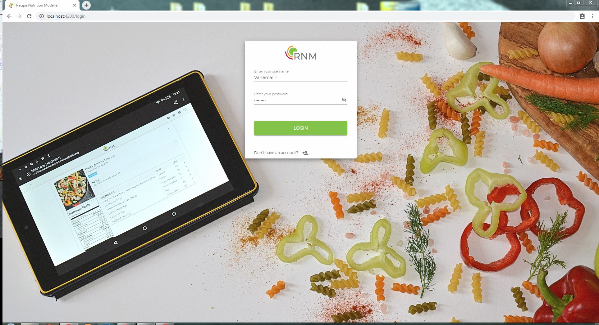
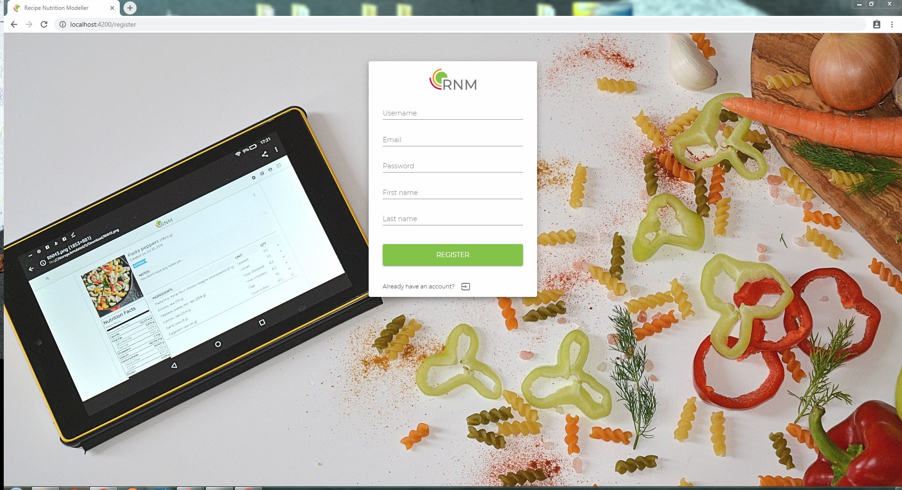
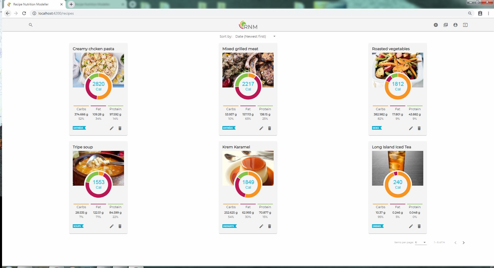
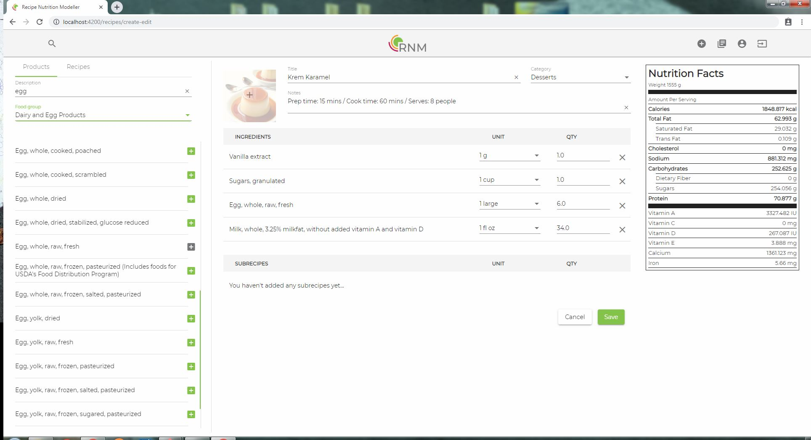
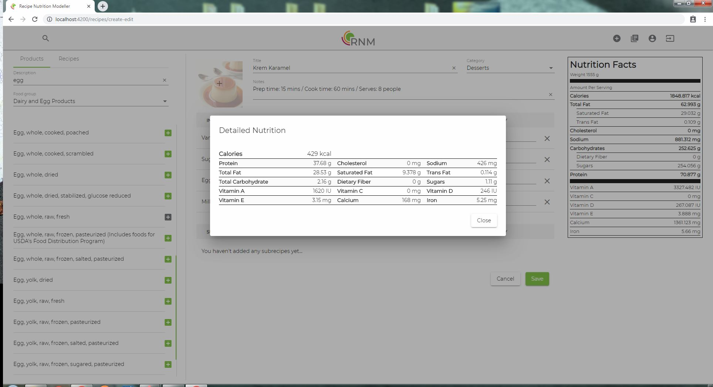
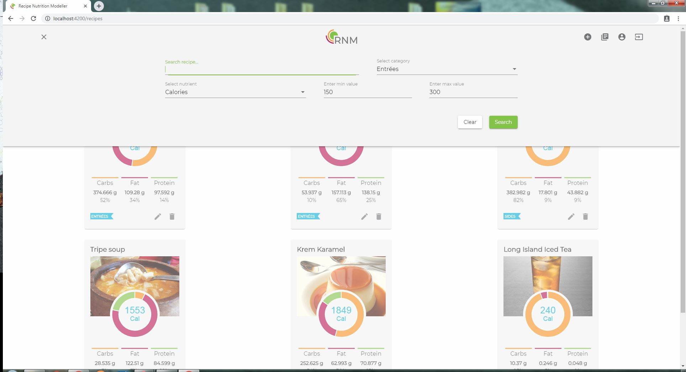
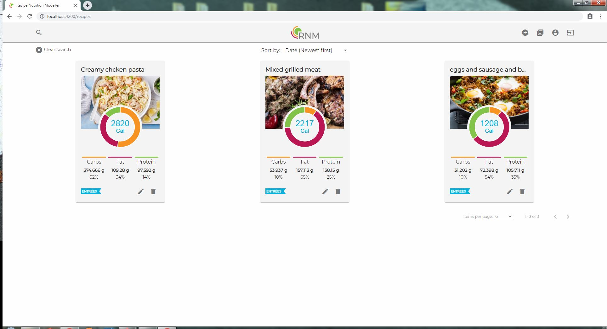
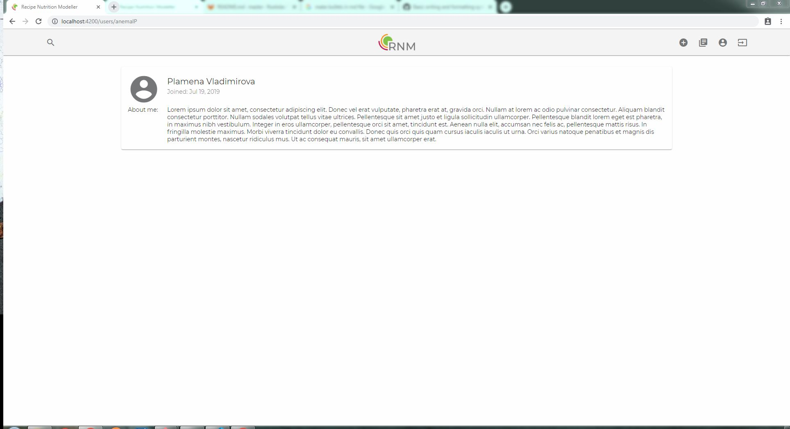

# Recipe Nutrition Modelling Client

  

Angular is a TypeScript-based open-source web application framework led by the Angular Team at Google and by a community of individuals and corporations.

# Description

This project was generated with [Angular CLI](https://github.com/angular/angular-cli) version 8.0.1.

Final Project Assignment for Telerik Academy Aplpha with JavaScript - Design and implement single-page web application that will allow restaurant chefs to create and manage recipes composed of products with known nutrition values. During the interaction with the system users should see changes in nutrition information in real time. Newly created recipes could be tagged with a category from a list.

## Libraries

- Angular Material
- Material icons
- NgChart

# Getting started

Make sure you have the [Angular CLI](https://github.com/angular/angular-cli#installation) installed globally. 

## Installation

Clone the repository

    git clone https://gitlab.com/recipe-nutrition-modelling/client.git

Switch to the repo folder

    cd client
    
Install dependencies
    
    npm install

### Development server

Run `ng serve` for a dev server. Navigate to `http://localhost:4200/`. The app will automatically reload if you change any of the source files.

### Build

Run `ng build` to build the project. The build artifacts will be stored in the `dist/` directory. Use the `--prod` flag for a production build.

### Running unit tests

Run `ng test` to execute the unit tests via [Karma](https://karma-runner.github.io).

# Functionality overview

## General functionality

- Authenticate users - Register, Login, Logout
- Users can CRUD recipes
- Users can serach list of recipes by name or filter by category or by choosen nutrition value between given boundaries
- Users can serach for product and filter by product group

## General page breakdown

- Sign in/Sign up pages (URL: /#/login, /#/register) 
    - Uses JWT (store the token in localStorage)
 

 

- All recipes page (URL: /#/recipes)
    - List of all recipes, created by the logged user
    - Chart for the main nutritions for each recipe
    - Delete and edit buttons for each recipe
    - Sorting by name and date
    - Pagination for the list of recipes
 

 

- Single recipe page (URL: /#/recipes/:recipeId)
    - Detailed view of the recipe
    - Delete, edit and saveAsPDF buttons
 

 

- Editor page to create/edit recipes (URL: /#/create-edit)
    - Searching and adding Products and Recipes to the recipe
    - Nutrition facts for the recipe
    - Nutrition facts for each recipe item (shown after click on the item's name)
 

 

- Search recipe by name, category, nutrition values (availabe at each page)
 

 

- Profile page (URL: /#/profile/:username, /#/profile/:username/favorites)
    - Show basic user info
 

 